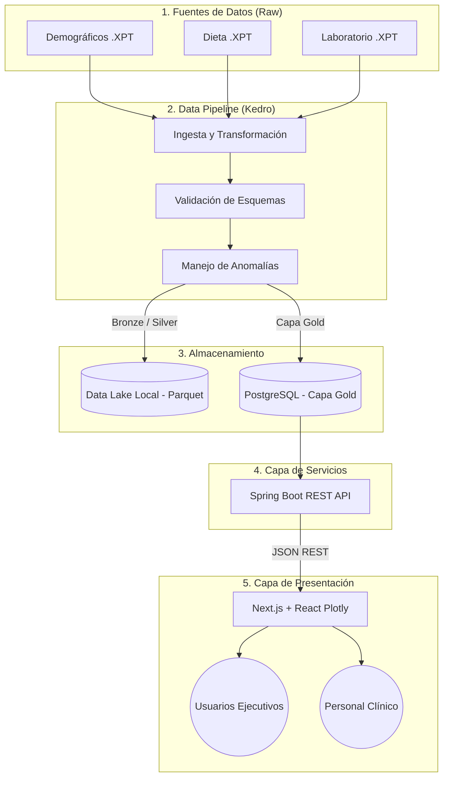

# Arquitectura del Sistema NHANES Health Analytics

La solución implementada sigue una arquitectura moderna, modular y escalable. A continuación se describe el flujo completo de los datos, desde la extracción hasta su visualización en el dashboard interactivo.

## Diagrama de Arquitectura

## Componentes Principales

### 1. Ingesta y ETL (Kedro Pipeline)
Utiliza el framework **Kedro** de Python para la orquestación del procesamiento de datos. Se manejan tres capas de madurez de datos:
- **Bronze / Raw:** Archivos SAS Transport (.XPT) originales del CDC.
- **Silver:** Datos limpios, normalizados y tipados.
- **Gold:** Datos analíticos finales, unidos por `SEQN`, listos para consumo.

Los errores y registros anómalos son capturados en `rejected_records.csv` para asegurar la calidad de la Capa Gold.

### 2. Base de Datos Analítica (PostgreSQL)
Los datos de la Capa Gold generados por Kedro se exportan a una base de datos **PostgreSQL** orquestada mediante Docker, funcionando como única fuente de verdad para el backend.

### 3. Backend (Spring Boot)
API RESTful construida en Java con **Spring Boot 3** y **Spring Data JPA**. Expone la data analítica a través de paginación (`Pageable`) para garantizar alta performance con grandes volúmenes de datos.

### 4. Frontend y Dashboards (Next.js)
Construido con **Next.js (React)** y estilizado con **Tailwind CSS**. Emplea **React-Plotly.js** para la renderización de visualizaciones complejas e interactivas en el cliente. La vista diferencia KPIs para el público general (ej: Riesgo Cardiovascular y Nutrición) de KPIs para especialistas (ej: HbA1c y Riesgo de Longevidad Clínica).
